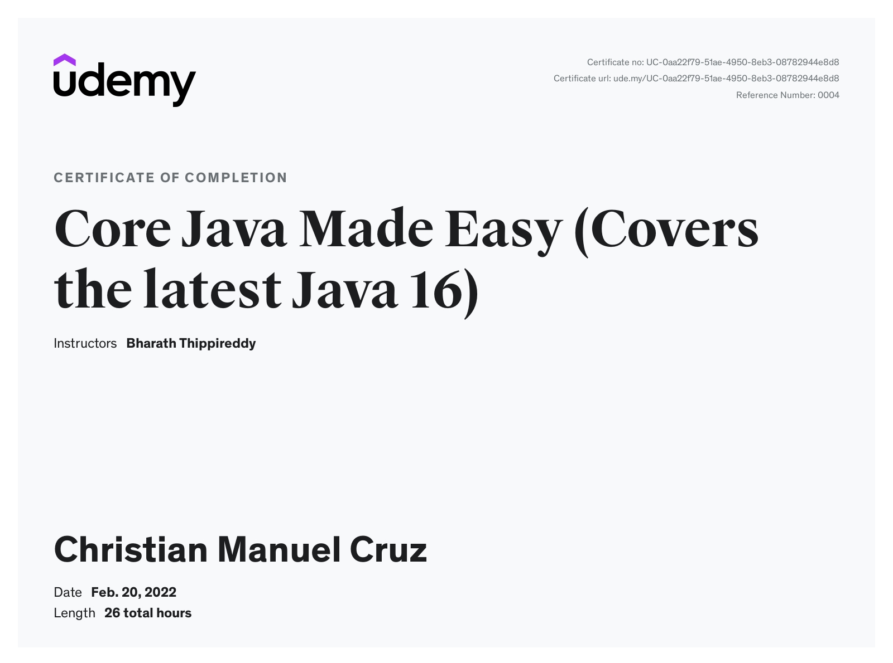

# Core Java Made Easy

[Core Java Made Easy](https://www.udemy.com/course/corejavamadeeasy/)

# Certificate of Completion



- [Core Java Made Easy](#core-java-made-easy)
- [Certificate of Completion](#certificate-of-completion)
  - [Introduction to Java](#introduction-to-java)
      - [Object Oriented Programming](#object-oriented-programming)
      - [Static and Non Static Context](#static-and-non-static-context)
  - [Data Types](#data-types)
  - [Wrapper Classes](#wrapper-classes)
  - [Operators](#operators)
  - [Access Modifiers](#access-modifiers)
  - [Inheritance](#inheritance)
      - [Constructor chaining](#constructor-chaining)
  - [Abstraction](#abstraction)
      - [Abstract Class](#abstract-class)
      - [Interface](#interface)
      - [Final](#final)
  - [Polymorphism](#polymorphism)
      - [Object Casting](#object-casting)
  - [Encapsulation](#encapsulation)
  - [Exceptions](#exceptions)
  - [Multithreading](#multithreading)
      - [Synchronization](#synchronization)
      - [InterThread Communication](#interthread-communication)
  - [Executor Framework](#executor-framework)
      - [Callable](#callable)
  - [Garbage Collection](#garbage-collection)
  - [Inner Classes](#inner-classes)
  - [String Handling](#string-handling)
  - [IO Streams](#io-streams)
      - [Binary Data](#binary-data)
      - [Character Data](#character-data)
      - [Serialization](#serialization)
  - [Arrays](#arrays)
  - [Equals and Hashcode](#equals-and-hashcode)
  - [Collections](#collections)
      - [ArrayList](#arraylist)
      - [LinkedList](#linkedlist)
      - [HashSet](#hashset)
      - [Iterator](#iterator)
      - [Comparable and Comparator](#comparable-and-comparator)
      - [HashMap](#hashmap)
      - [PriorityQueue](#priorityqueue)
      - [Collections and Arrays](#collections-and-arrays)
      - [Generics](#generics)
  - [Enums](#enums)
  - [Concurrent Collections](#concurrent-collections)
      - [Blocking Queue](#blocking-queue)
  - [HTTP/2 Client](#http2-client)
  - [Socket Programming](#socket-programming)
  - [Java 8](#java-8)
      - [Lambda Expression](#lambda-expression)
      - [Functional Interface](#functional-interface)
      - [Default Methods in Interface](#default-methods-in-interface)
      - [Predicates](#predicates)
      - [Functions](#functions)
      - [Double Colon Operator](#double-colon-operator)
      - [Streams](#streams)
  - [JVM Architecture](#jvm-architecture)
      - [Class Loader](#class-loader)
      - [Class Loading Sub System](#class-loading-sub-system)
      - [Memory Areas](#memory-areas)
  - [Internationalization](#internationalization)
  - [Annotations and Reflection API](#annotations-and-reflection-api)
  - [Different Ways of Creating Objects](#different-ways-of-creating-objects)
  - [Java 9](#java-9)
      - [Private Methods in Interfaces](#private-methods-in-interfaces)
      - [Improved Try-Resource blocks](#improved-try-resource-blocks)
      - [Immutable Collections](#immutable-collections)
      - [Streaming API](#streaming-api)
      - [Modules](#modules)
  - [Java 10](#java-10)
      - [Var variables](#var-variables)
      - [Collectors](#collectors)
  - [Java 11](#java-11)
      - [String API Updates](#string-api-updates)
      - [Files API Updates](#files-api-updates)
  - [Java 12](#java-12)
      - [String API Updates](#string-api-updates-1)
      - [CompactNumberInstance](#compactnumberinstance)
      - [Collectors](#collectors-1)
  - [Java 13 and Java 14](#java-13-and-java-14)
      - [String Content Block](#string-content-block)
      - [Switch Expression Syntax](#switch-expression-syntax)
      - [instanceof Pattern Matching](#instanceof-pattern-matching)
      - [Record](#record)
  - [Java 15](#java-15)
      - [Sealed Classes and Interface](#sealed-classes-and-interface)
  - [Java 16](#java-16)
      - [Stream toList()](#stream-tolist)
  - [Interview Questions](#interview-questions)
      - [Constructors](#constructors)
      - [Overloading vs Overriding](#overloading-vs-overriding)
      - [Final, Finally and Finalize](#final-finally-and-finalize)
      - [Generics and Type Erasure](#generics-and-type-erasure)
      - [== vs equals()](#-vs-equals)
      - [Class Loaders](#class-loaders)
      - [serialVersionUID](#serialversionuid)

## Introduction to Java

The JDK comes with the Java compiler and the JRE. The Java compiler converts source code into byte code which is then run by the JVM. This gives Java platform independency. The JRE in turn has JVM which converts byte code into machine code .It also comes with a set of predefined APIs and libraries. JRE provides the environment for a Java compiled byte code to run. JVM uses JIT compiler to perform work efficiently.

#### Object Oriented Programming

Java With OOP, it is easy to map real world problems to software solutions. OOP has 4 principles: Encapsulation, Inheritance, Abstraction, and Polymorphism. We implement these principles through classes and objects.

**Encapsulation** is about protecting the properties and functionalities of an object from other objects. It also allows us to write both data and functionality through a _class_.

**Inheritance** is the process of defining a new object with the help of an existing object. We use _extends_ in Java to inherit. The two important things in inheritance are _accessing existing objects functionality_ and _updating existing objects functionality_. We also use the term _IS A_ to refer to inheritance.

**Abstraction** is the principle of hiding the unnecessary details of an object, and only showing the necessary details that are needed by other objects to communicate with that object. In Java we issue abstractions through an _interface_.

An object has the qualities of **Polymorphism** if it can behave in different ways. In Java, we achieve polymorphism through _overloading and overriding_.

#### Static and Non Static Context

Static are also known as class-level context while Non Static are object-level. Code inside a static block will be executed once by the JVM when the class is loaded even before the main method is called. To access static members, we need to use the class name. Memory is allocated and variables are initialized during class loading.

```java
public class StaticMethodsDemo {
	public static void main(String[] args) {
		System.out.println("inside main");
		StaticMethodsDemo.method1();
	}

	static void method1() {
		System.out.println("Inside static method");
	}

	static {
		System.out.println("Inside static block");
		StaticMethodsDemo.method1();
	}
}
```

```
Inside static block
Inside static method
inside main
Inside static method
```

Any functionality that is specific to a particular object of a class should be defined as Non-Static members. This means that values will be specific to a particular object of a class. A non-static block is executed by the JVM everytime we create an object before the constructor is invoked. Memory is allocated and variables are initialized on object creation.

```java
public class NonStaticMembersDemo {
	int num;

	NonStaticMembersDemo() {
		System.out.println("Inside the constructor");
	}

	{
		System.out.println("Inside the non static block");
	}

	public static void main(String[] args) {
		System.out.println("Inside the main method");
		new NonStaticMembersDemo();
    new NonStaticMembersDemo();
	}


}
```

```
Inside static block
Inside the main method
Inside the non static block
Inside the constructor
Inside the non static block
Inside the constructor
Inside the non static block
Inside the constructor
```

## Data Types

Data types tell what kind of data a value can carry. Under primitive types we have byte, short, int, long, char, float, double, boolean. For reference types, we have class, arrays, strings etc. We can convert one type to another type with Type Casting. Implicit type casting happens automatically, while for Explicit type casting we need to specify manually.

Primitive implicit type casting happens when converting from a lower data type to a higher one, for example, byte->int. Primitive explicit type casting happens the other way around such as byte->int.

Reference implicit type casting happens when a child class object is assigned to a parent class object while explicit is the other way around.

## Wrapper Classes

Wrapper classes help us primitive types to object types which is called boxing. We can also do the reverse which is called unboxing. We mainly use Wrapper CLasses with Collections API since collection classes only work with object types. Each primitive type has a corresponding class (int->Integer). We can also convert from primitive to spring and vice versa.

```java
public class PrimitiveAndObject {
  public static void main(String[] args) {
    int x = 100;
    Integer y = Integer.valueOf(x);
    int z = y.intValue();
  }
}

public class PrimitiveAndString {
  public static void main(String[] args) {
    byte x = 100;
    String s = Byte.toString(x);
    byte y = Byte.parseByte(s);
  }
}
```

## Operators

The ++ and -- operators represent increment and decrement. There are two types: Pre increment and Post increment.

```java
public class UnaryOperators {

	public static void main(String[] args) {
		int x = 10;
		int y = ++x;

		int a = 10;
		int b = a++;

		System.out.println(x);
		System.out.println(y);
		System.out.println("----");
		System.out.println(a);
		System.out.println(b);
	}
}
```

```
11
11
----
11
10
```

The equality operators == != can be used with primitives and objects as well. In the case of object, it will check if two objects point to the same reference in memory. Bitwise operators & | ^ can be applied to boolean and integer types. The bitwise unary complement ~ will flip all the bits of a binary representation of an integer.

Short circuit operators represented by && || can only be applied to boolean arguments. This operator checks only the first boolean value, if it is false for &&, it will return false immediately and won't check for the value of the second boolean. The same happens for ||, if the first value is true then it will immediately return true. This results in improved performance.

The = assignment operator will assign the value on the right hand to the variable on the left hand side. If it is an object, the memory location of the object will be assigned to the reference variable.

## Access Modifiers

Java supports access permissions at different levels such as class, variables, methods, constructor. The levels of access are private, package, protected and public. **Package** access level is used when no keywords are used and is accessible by any class within the same package. **Private** can only be accessed from within the class. **Protected** can be accessed by any class from within the same package, and also from other packages that extends the class. **Public** can be accessed anywhere.

## Inheritance

Every class implicity extends the superclass **java.lang.Object**, which is a type of Single Inheritance. Inheritance allows child objects to access parent methods. In this case, the Parent implicitly extends Object, and the Child extends Parent. The Child class has access to Parent methods and Object methods as well. When the Child object is instantiated, the JVM automatically instantiates its Parent class first before the Child class. In this case, since no constructor was defined, the JVM uses the default constructor.

```java
public class Parent {
	void f1() {
		System.out.println("Inside parent f1");
	}
}

public class Child extends Parent {
	void f2() {
		System.out.println("inside Child f2");
	}
}

public class MultilevelTest {
	public static void main(String[] args) {
		Child c = new Child();
		c.f1();
		c.f2();
		c.hashCode();
	}
}
```

We can override a parent class methods by having a child with the same method name. We can access the parent's method of the same name using the **super** keyword. The **super()** method is used in the constructor to invoke the parent's constructor.

```java
public class Parent {
	int a, b;

	Parent(int a, int b) {
		this.a = a;
		this.b = b;
	}

	void f1() {
		System.out.println("Inside parent f1");
	}
}

public class Child extends Parent {
	int c,d;

	Child(int a, int b, int c, int d) {
		super(a,b);
		this.c = c;
		this.d = d;
	}

	void f1() {
		super.f1();
		System.out.println("Inside child f1");
	}
}

public class Test {
	public static void main(String[] args) {
		Child c = new Child(10,20,30,40);
		c.f1();
	}
}
```

#### Constructor chaining

Constructor chaining is the concept where using the super method and this method we can access more than 1 constructor of the child and the parent in a single object creation. In this case, the main method will first call the ChildClass default constructor method which will in turn invoke the constructor of the ChildClass with argument x=10, which in turn will invoke the SuperClass constructor, which will invoke its own constructor with an argument, which will then finally invoke the constructor without an argument.

```java
public class SuperClass {
	int x;
	public SuperClass() {
		System.out.println("NO ARG SUPERCLASS CONSTRUCTOR");
	}
	public SuperClass(int x) {
		this();
		this.x = x;
		System.out.println("1 ARG SUPERCLASS CONSTRUCTOR");
	}
}

public class ChildClass extends SuperClass{
	public ChildClass() {
		this(10);
		System.out.println("NO ARG CHILDCLASS CONSTRUCTOR");
	}

	public ChildClass(int x) {
		super(x);
		System.out.println("1 ARG CHILDCLASS CONSTRUCTOR");
	}

	public static void main(String[] args) {
		ChildClass c = new ChildClass();
	}
}
```

```
NO ARG SUPERCLASS CONSTRUCTOR
1 ARG SUPERCLASS CONSTRUCTOR
1 ARG CHILDCLASS CONSTRUCTOR
NO ARG CHILDCLASS CONSTRUCTOR
```

When we use the final keyword on a method, the child classes can only inherit and not override that method.

```java
	protected final void work() {
		System.out.println("COMMON WORK FOR EVERYONE");
	}
```

## Abstraction

Abstraction hides the details of the underlying object being used from the object using it. We can implement partial abstraction through abstract classes and complete abstraction through interfaces. We use the keyword **abstract** to mark a class or method as abstract, and once we mark a class as abstract, we cannot create instances of it.

#### Abstract Class

In this sample, we create the abstract class BMW. The abstract method accelerate will be up to do subclass' implementation.

```java
public abstract class BMW {
	void commonFunc() {
		System.out.println("Inside commonFunc method");
	}

	abstract void accelerate();
}
```

The subclass should implement all the abstract methods in the abstract class. If we don't provide an implementation, we should mark the class as abstract also. We cannot mark an abstract class as final, since we cannot inherit from a final class. Abstract methods cannot be marked as static because we need to define their implementations in other methods.

```java
public class ThreeSeries extends BMW {
	@Override
	void accelerate() {
		System.out.println("Inside 3 Series accelerate");
	}
}

public class FiveSeries extends BMW {
	@Override
	void accelerate() {
		System.out.println("Inside 5 series accelerate");
	}
}

public class Test {
	public static void main(String[] args) {
		ThreeSeries three = new ThreeSeries();
		FiveSeries five = new FiveSeries();
		three.accelerate();
		three.commonFunc();
		five.accelerate();
		five.commonFunc();
	}
}
```

```
Inside 3 Series accelerate
Inside commonFunc method
Inside 5 series accelerate
Inside commonFunc method
```

#### Interface

The compiler automatically marks all methods in an interface as public and abstract.

```java
public interface Car {
	void go();
	void stop();
}

public class Honda implements Car{
	@Override
	public void go() {
		System.out.println("Inside Honda GO");
	}

	@Override
	public void stop() {
		System.out.println("Inside Honda stop");
	}
}
```

A Marker Interface is an interface without any methods. Examples of Marker Interface are Serializable, Cloneablew, RandomAccess.

The key difference between an interface and abstract class is that in interfaces, all methods are abstract whereas in abstract class is a partial implementation and can have at least 1 abstract method. In an interface, variables are public static and final, and variables should be initialized when they are defined. Abstract classes can define blocks and also can have constructors.

Aside from complete abstraction, interfaces also provides the advantage of multiple inheritance in that a class can implement multiple interfaces.

#### Final

When we mark a class as final, it cannot be extended or inherited. A final object or variable's reference and value cannot be changed. The only where we can assign the value of a final variable is at the constructor method or at object creation. A final method cannot be overriden in a child class.

## Polymorphism

Polymorphism means that an object can behave differently when communicating between different objects. The two types of polymorphism in Java are **Compile Time** or Static Binding and **Runtime** or Dynamic Binding. We achieve Compile Time polymorphism through _method overloading_. The compiler selects which specific method should be executed by the JVM depending on the parameters passed.

```java
public class CompileTimeBinding {
	void add(int a, int b) {
		int result = a + b;
		System.out.println(result);
	}

	void add(int a, int b, int c) {
		int result = a + b + c;
		System.out.println(result);
	}

	void add(float a, float b) {
		float result = a + b;
		System.out.println(result);
	}

	public static void main(String[] args) {
		CompileTimeBinding obj = new CompileTimeBinding();
		obj.add(5.2f, 1.2f);
		obj.add(1, 2, 3);
		obj.add(0, 1);
	}
}
```

```
6.3999996
6
1
```

Runtime polymorphism on the other hand is achieved through _method overriding_. It is also the process of holding the child class reference using the parent class variable and accessing child functionalities using the parent class reference.

```java
public class Macbook {
	void start() {
		System.out.println("Inside Macbook Start");
	}

	void shutdown() {
		System.out.println("Inside Macbook shutdown");
	}
}

public class MacbookPro extends Macbook{
	@Override
	void start() {
		System.out.println("MacbookPro start");
	}

	@Override
	void shutdown() {
		System.out.println("MacbookPro shutdown");
	}

  public void proMethod() {
		System.out.println("Macbook Pro advanced feature");
	}
}

public class MacbookAir extends Macbook{
	@Override
	void start() {
		System.out.println("MacbookAir start");
	}

	@Override
	void shutdown() {
		System.out.println("MacbookAir shutdown");
	}
}

public class Test {
	public static void main(String[] args) {
		Macbook m1 = new MacbookPro();
		Macbook m2 = new MacbookAir();

		m1.start();
		m2.start();
		m1.shutdown();
		m2.shutdown();
	}
}
```

```
MacbookPro start
MacbookAir start
MacbookPro shutdown
MacbookAir shutdown
```

#### Object Casting

Upcasting happens when a child object is casted into a parent class. This is done automatically by the JVM. Downcasting on the other hand has to be done explicitly. In this case, we convert m1 AppleLaptop interface into a MacbookPro. The main advantage of downcasting is that it allows us to invoke behaviors that are specific to the child class, in this case proMethod().

```java
public class Test {
	public static void main(String[] args) {
    // upcasting
		AppleLaptop m1 = new MacbookPro();
		AppleLaptop m2 = new MacbookAir();

    // downcasting
		MacbookPro m3 = (MacbookPro) m1;
		m3.proMethod();

}

```

## Encapsulation

Encapsulation is the process of binding the methods and properties together so that only those methods can access those properties. We define accessor methods using getters and setters. This brings security and maintainability for our code.

```java
public class Customer {
	private String firstName;
	private String lastName;
	private String creditCard;

	public String getFirstName() {
		return firstName;
	}
	public void setFirstName(String firstName) {
		this.firstName = firstName;
	}
	public String getLastName() {
		return lastName;
	}
	public void setLastName(String lastName) {
		this.lastName = lastName;
	}
	public String getCreditCard() {
		return creditCard;
	}
	public void setCreditCard(String creditCard) {
		this.creditCard = creditCard;
	}
}
```

## Exceptions

There are three types of error: Compile Time Errors, Logical Errors, and Runtime Errors. **Compile Time Errors** happen when there are symbols that could not be found, incompatible types, invalid declarations and using _this_ inside a static context. **Logical Errors** happens when the code outputs unexpected results. **Runtime Errors** or exceptions will cause our program to terminate abruptly. This is often accompanied by error messages.

In Java, an **Exception** is a class which the JVM creates and throws. All Exceptions and Error inherit from a parent class **Throwable** from java.lang. All exceptions that inherit from RuntimeException are called _unchecked exceptions_. To handle Exceptions, we can use try catch throw finally throws.

We can handle multiple exceptions using multiple catch blocks. Aside from this, we can also use the parent **RuntimeException** to handle all children exceptions.

```java
public class MultiCatch {
	public static void main(String[] args) {
		try {
			String input = args[0];
			System.out.println("Input is " + input);
			int output = Integer.parseInt(input);
			System.out.println("Output is" + output);
		} catch (ArrayIndexOutOfBoundsException e) {
			System.out.println(e);
		} catch (NumberFormatException e) {
			System.out.println(e);
		}
	}
}
```

The finally block can be used at the end of the try catch. The code in the finally block will be executed always regardless if there is an error or none. This will be a good place for writing JDBC connections.

```java
public class Division {
	public static void main(String[] args) {
		int a, b, c;

		try {
			System.out.println("Enter two integers");
			Scanner obj = new Scanner(System.in);
			a = obj.nextInt();
			b = obj.nextInt();
			c = a / b;
			System.out.println(c);
		} finally {
			System.out.println("Inside Finally");
		}
		System.out.println("More code here");
	}
}
```

```
Enter two integers
5
0
java.lang.ArithmeticException: / by zero
Inside Finally
More code here
```

When we use the **throws** keyword, it means that the object calling the method will be the one responsinble for handling exceptions. In this case, the main method will be the one to handle the exception

```java
public class CheckedException {
	void readFile() throws FileNotFoundException {
		FileInputStream fis = new FileInputStream("");
	}

	public static void main(String[] args) {
		CheckedException ce = new CheckedException();
		try {
			ce.readFile();
		} catch (FileNotFoundException e) {
			e.printStackTrace();
		}
	}
}
```

We can create and throw our own custom exceptions, both checked and unchecked. We can write our constructors with it too.

```java
public class UncheckedCustomException extends RuntimeException {
	UncheckedCustomException(String message) {
		super(message);
	}
}

public class CheckedCustomException extends Exception{
	CheckedCustomException(String message) {
		super(message);
	}
}

public class Test {
	public static void main(String[] args) throws CheckedCustomException {
//		throw new UncheckedCustomException("CUSTOM ERROR MESSAGE HERE");
		throw new CheckedCustomException("CUSTOM EXCEPTION THAT NEEDS TO BE HANDLED");
	}
}
```

Assertions are introduced in Java 1.4. An AssertionError from java.lang.Error will be thrown if an assert expression results to false. Assertions are disabled by default at runtime, and to enable, we need the `java -ea MyClass` flag to enable assertions. Assertions are typically used for testing.

```java
public class AssertionsDemo {
	public static void main(String[] args) {
		int withdraw = 100;
		int balance = 50;

		assert (withdraw <= balance) : "amount to be withdrawed is more than the balance";
	}
}
```

## Multithreading

The main method is the first thread that the JVM creates. For the single threaded example below, the numbers 1-200 will be printed for i first, and then for j.

```java
public class SingleThreaded {
	public static void main(String[] args) {

		SingleThreaded st = new SingleThreaded();
		st.printNumbers();

		for (int j = 1; j <= 200; j++) {
			System.out.print("j: " + j + "\t");
		}
	}

	void printNumbers() {
		for (int i = 1; i <= 200; i++) {
			System.out.print("i: " + i + "\t");
		}
	}
}
```

To implement multithreading, we can either implement the Runnable interface or extend the Thread class. The starting point for the executing for a thread is the run() method. The start() method is used to create a thread space and will invoke the run method internally. Using Thread.sleep(), the thread will be in sleep mode for the duration. There will be a 1 second gap between each print.

```java
public class Multithreaded extends Thread {
	public static void main(String[] args) throws InterruptedException {
		Multithreaded mt = new Multithreaded();
		mt.start();

		for (int j = 1; j <= 200; j++) {
			System.out.print("j: " + j + "\t");
			Thread.sleep(1000);
		}
	}

	public void run() {
		for (int i = 1; i <= 200; i++) {
			System.out.print("i: " + i + "\t");
			try {
				Thread.sleep(1000);
			} catch (InterruptedException e) {
				e.printStackTrace();
			}
		}
	}
}
```

```
j: 1	i: 1	j: 2	i: 2	j: 3	i: 3	j: 4	i: 4	i: 5	j: 5	i: 6	j: 6
```

We can invoke Thread.currentThread() to get the current active thread. We can also set priorities of threads using Thread.setPriority() with values 1 to 10.

```java
public class Multithreaded extends Thread {
	public static void main(String[] args) throws InterruptedException {
		Multithreaded mt = new Multithreaded();
		mt.setPriority(MAX_PRIORITY);
		mt.setName("mt");
		mt.start();

		Multithreaded mt1 = new Multithreaded();
		mt1.setPriority(MIN_PRIORITY);
		mt1.setName("mt1");
		mt1.start();

  }

	public void run() {
		System.out.println("thread name: " + Thread.currentThread().getName());
  }
}
```

The join method of the Thread class makes sure that the thread has completed before executing other threads. In this case, the current thread in main will pause until jd completes. Using

```java
public class JoinDemo extends Thread {
	static int n, sum;

	public static void main(String[] args) {

		long startTime = System.currentTimeMillis();
		System.out.println("Sum of first N numbers");
		System.out.println("Enter a number");
		Scanner scanner = new Scanner(System.in);
		JoinDemo.n = scanner.nextInt();

		JoinDemo jd = new JoinDemo();
		jd.start();
		try {
			jd.join();
		} catch (InterruptedException e) {
			e.printStackTrace();
		}

		System.out.println("sum of first " + JoinDemo.n + " numbers is " + JoinDemo.sum);
		long endTime = System.currentTimeMillis();

		System.out.println("Total time taken " + (endTime - startTime) / 1000);
	}

	public void run() {
		for (int i = 1; i <= JoinDemo.n; i++) {
			JoinDemo.sum += i;
			try {
				Thread.sleep(100);
			} catch (InterruptedException e) {
				e.printStackTrace();
			}
		}
	}
}
```

We can also use multithreading with the runnable interface. This will allow us to extend other classes.

```java
public class CheckProcessor implements Runnable {

	@Override
	public void run() {
		System.out.println("Processed check");
	}

	public static void main(String[] args) {
		CheckProcessor cp = new CheckProcessor();
		Thread t = new Thread(cp);
		t.start();
	}
}
```

#### Synchronization

When multiple threads are accessing the same object simultaneously, data between must be synchronized in order to prevent corruption. We mark by using the keyword **synchronized**, and the first thread that will access will get a lock on the object. Once the thread finishes method execution, it will release the lock. This is taken care of by the JVM.

```java
public class DisplayMessage {
	public synchronized void sayHello(String name) {
		for (int i=1; i<=5; i++) {
			System.out.println("Hello " +  name);
			try {
				Thread.sleep(2000);
			} catch (InterruptedException e) {
				// TODO Auto-generated catch block
				e.printStackTrace();
			}
		}
	}
}

public class MyThread extends Thread{
	DisplayMessage dm;
	String name;

	MyThread(DisplayMessage dm, String name) {
		this.dm = dm;
		this.name = name;
	}

	public void run() {
		dm.sayHello(name);
	}
}

public class SynchronizationDemo {
	public static void main(String[] args) {
		DisplayMessage dm = new DisplayMessage();
		MyThread t1 = new MyThread(dm, "doge");
		MyThread t2 = new MyThread(dm, "cate");

		t1.start();
		t2.start();
	}
}
```

The output will be:

```
Hello doge
Hello doge
Hello doge
Hello doge
Hello doge
Hello cate
Hello cate
Hello cate
Hello cate
Hello cate
```

Every class in Java has a unique lock. If a thread wants to execute a static synchronized method, it will first get the class level lock. The other threads will have to wait for their turn to execute a static synchronized method. Other threads will still have access to static method and instance methods. Instead of marking the entire method with synchronized, we can also use synchronized blocks. Other threads can enter the method and execute the code before the synchronized block, but will have to wait until the thread finishes the synchronized block.

```java
public class DisplayMessage {
	public void sayHello(String name) {
		// Any code can go here

		synchronized (this) {
			for (int i=1; i<=5; i++) {
				System.out.println("Hello " +  name);
				try {
					Thread.sleep(2000);
				} catch (InterruptedException e) {
					// TODO Auto-generated catch block
					e.printStackTrace();
				}
			}
		}
	}
}
```

#### InterThread Communication

We can use the wait() method to temporarily release a thread's lock on an object and allow another thread to access that object wherein it will invoke the notify() method to release the lock and notify the first thread that it can start running again.

In the sample application, the thread class will calculate the sum of numbers from 1-100, but the results should be displayed by the main thread.

```java
public class MainThread {
	public static void main(String[] args) throws InterruptedException {
		MyThread t = new MyThread();
		t.start();

		synchronized(t) {
			System.out.println("Main Thread is going to wait");
			t.wait();
			System.out.println("Main Thread notified");
			System.out.println(t.total);
		}
	}
}

public class MyThread extends Thread {
	int total;

	@Override
	public void run() {
		System.out.println("Child Thread is calculating the sum");
		synchronized (this) {
			for (int i = 1; i <= 100; i++) {
				total += i;
			}
			this.notify();
		}
	}
}
```

```
Main Thread is going to wait
Child Thread is calculating the sum
Main Thread notified
5050
```

## Executor Framework

The Executor Framework introduced in Java 1.5 overcomes limitations of traditional approach of using threads such as time consuming, poor resource management, robustness by giving us a thread pool. It allows us to create a pool of threads which can be assigned to a particular task as assigned, and once finished with a task, the thread returns to the pool. The Executor framework manages the lifecycle of the thread.

We start with creating the thread class CheckProcessorTask which should implement **Runnable**

```java
public class CheckProcessorTask implements Runnable {
	String name;

	public CheckProcessorTask(String name) {
		this.name = name;
	}

	@Override
	public void run() {
		System.out.println(name + " Check Processor has began processing the check " + Thread.currentThread().getName());
		try {
			Thread.sleep(3000);
		} catch (InterruptedException e) {
			e.printStackTrace();
		}

		System.out.println(name + " CheckProcessor has completed" + Thread.currentThread().getName());
	}
}
```

We then write out the thread pool using Executor. In this case, we only allot two threads for the pool.

```java
public class ExecutorDemo {
	public static void main(String[] args) {
		CheckProcessorTask[] cps = { new CheckProcessorTask("ATM"), new CheckProcessorTask("Bank"),
				new CheckProcessorTask("Mobile"), new CheckProcessorTask("Web") };
		ExecutorService service = Executors.newFixedThreadPool(2);

		for (CheckProcessorTask checkProcessorTask : cps) {
			service.submit(checkProcessorTask);
		}

		service.shutdown();
	}
}
```

The output is as follows:

```
ATM Check Processor has began processing the check pool-1-thread-1
Bank Check Processor has began processing the check pool-1-thread-2
ATM CheckProcessor has completedpool-1-thread-1
Mobile Check Processor has began processing the check pool-1-thread-1
Bank CheckProcessor has completedpool-1-thread-2
Web Check Processor has began processing the check pool-1-thread-2
Mobile CheckProcessor has completedpool-1-thread-1
Web CheckProcessor has completedpool-1-thread-2
```

#### Callable

When we use the Runnable interface, the run() method cannot return any value. We can use Callable<V> V call() instead to return a value. We pass a callable instance to the executor framework which will return a Future object. We start with creating our thread class that implemens the Callable interface.

```java
public class MyCallable implements Callable<Integer> {
	int num;

	MyCallable(int num) {
		this.num = num;
	}

	@Override
	public Integer call() throws Exception {
		System.out.println(Thread.currentThread().getName() + " is calculating summation of numbers up to " + num);
		int sum = 0;
		for (int i = 1; i <= num; i++) {
			sum += i;
		}
		return sum;
	}
}
```

And then we write out our main method:

```java
public class CallableFutureDemo {
	public static void main(String[] args) {
		MyCallable[] callables = { new MyCallable(10), new MyCallable(20), new MyCallable(30), new MyCallable(40),
				new MyCallable(50), new MyCallable(60) };

		ExecutorService service = Executors.newFixedThreadPool(3);

		for (MyCallable myCallable : callables) {
			Future<Integer> future = service.submit(myCallable);
			try {
				System.out.println(future.get());
			} catch (InterruptedException | ExecutionException e) {
				e.printStackTrace();
			}
		}
		service.shutdown();
	}
}
```

The output will be

```
pool-1-thread-1 is calculating summation of numbers up to 10
55
pool-1-thread-2 is calculating summation of numbers up to 20
210
pool-1-thread-3 is calculating summation of numbers up to 30
465
pool-1-thread-1 is calculating summation of numbers up to 40
820
pool-1-thread-2 is calculating summation of numbers up to 50
1275
pool-1-thread-3 is calculating summation of numbers up to 60
1830
```

## Garbage Collection

In java, each thread has stack space where all the local primitives are stored and the heap space where objects are allocated into memory. All the references will point to these memory locations in heap. JVM automatically clears memory allocated to an object via garbage collection. It is a daemon thread that runs within the JVM and garbage collects objects once they are unreachable.

We create a test class which overwrites the finalize() method of java Object. This method gets called when the memory is released just before the JVM's garbage collector thread removes the objects. We create two instances of the class and we don't assign to memory so that the garbage collector will purge these. It is important to note that the Garbage Collector thread only runs when low on memory. We can also request garbage collection manually using **System.gc()**. In this case, the unreferences GCDemo objects will be requested to be collected.

```java
public class GCDemo {
	int objId;

	GCDemo(int objId) {
		this.objId = objId;
		System.out.println("created " + this.objId);
	}

	public static void main(String[] args) {
		new GCDemo(1);
		new GCDemo(2);
		for (int i = 1; i <= 100; i++) {
			System.gc();
		}
	}

	@Override
	protected void finalize() {
		System.out.println("finalized " + objId);
	}
}
```

## Inner Classes

To invoke a static Inner class static method, we use Outer.Inner.method(). To invoke an Inner class non static method, we need to create an instance of the inner class.

```java
public class Outer {
	static void f1() {
		System.out.println("Outers static method");
	}

	static class Inner {
		// static inner class method
		static void f2() {
			System.out.println("Inners static method");
		}
		// non static inner class method
		void f3() {
			System.out.println("inners non static method");
		}
	}

	public static void main(String[] args) {
		Outer.f1();
		Outer.Inner.f2();
		Outer.Inner inner = new Outer.Inner();
		inner.f3();
	}
}
```

We can also use non static inner classes. To create a non static inner class object is to use an instance of the parent class then the **parent.new** operator. We cannot define a non static method inside a non static inner class because we cannot have static inside a non static area. To access the static variable of the outer class, we simply need to call Outer.x. For the non static variable, we need to use Outer.this.y.

```java
public class Outer {
	private static int x = 5;
	private int y;

	Outer(int y) {
		this.y = y;
	}

	void f1() {
		System.out.println("Outer class non static method");
	}

	class Inner {
		private int y;

		Inner(int y) {
			this.y=y;
		}

		void f2() {
			System.out.println("Inside inner class non static method");
			System.out.println("Outer class X " + Outer.x);
			System.out.println("Outer class Y " + Outer.this.y);
			System.out.println("Inner class Y"  + this.y);

		}
	}

	public static void main(String[] args) {
		Outer outer = new Outer(80);
		outer.f1();
		Outer.Inner inner = outer.new Inner(80);
		inner.f2();

		System.out.println(inner.y);
	}
}
```

```
Outer class non static method
Inside inner class non static method
Outer class X 5
Outer class Y 80
Inner class Y80
80
```

A local inner class is a class that is created inside a block, method or constructor. This class can only be accessed from within that block/method/constructor.

```java
public class Outer {

	void f1() {
		System.out.println("Inside Outer f1");

		class LocalInner {
			void f2() {
				System.out.println("Inside Local Inner f2");
			}
		}

		LocalInner inner = new LocalInner();
		inner.f2();
	}

	public static void main(String[] args) {
		Outer outer = new Outer();
		outer.f1();
	}
}
```

```
Inside Outer f1
Inside Local Inner f2
```

Anonymous inner classes are defined inside a method. Using anonymous inner classes, we can implement interfaces with its original interface identity. For example, if an interface is Connection, we can use the same name Connection when we implement the inner class. We cannot define a constructor since an anonoymous inner class does not have a class name of its own. In this example, we created a static method getConnection() wherein which we created an anonymous inner class which implemented our custom Connection interface.

```java
public class DriverManager {
	static Connection getConnection() {
		Connection con = new Connection() {
			@Override
			public void createStatemenet() {
				System.out.println("Inside anonymous inner class method");
			}
		};
		return con;
	}
}

public class Test {
	public static void main(String[] args) {
		Connection con = DriverManager.getConnection();
		con.createStatemenet();
	}
}
```

## String Handling

Compared to String, StringBuffer is mutable and synchronized.

```java
public class StringBufferDemo {
	public static void main(String[] args) {
		StringBuffer sb = new StringBuffer();
		System.out.println(sb.capacity());

		sb.append("Doge doge doge");
		sb.append("cate cate cate");

		System.out.println(sb);
		System.out.println(sb.capacity());
	}
}
```

```
16
Doge doge dogecate cate cate
34
```

## IO Streams

A stream is a logical handle from which we can read data or write data to. Java supports ByteStreams, CharacterStreams, BufferedStreams, ObjectStreams which are all from java.io. **ByteStreams** read and write one byte at a time. **CharacterStreams** uses unicode so it reads one character at a time (2 bytes). **BufferedStreams** are wrappers for ByteStreams and CharacterStreams allowing us to read more data. **ObjectStreams** allow us to read and write objects through a process called Serialization.

#### Binary Data

We can read files using **FileInputStream** from java.io which returns reads one byte at a time and returns an int. This will return -1 once it reaches the end of the file. We loop through the file and typecast the integer into char.

```java
public class FileInputStreamDemo {
	public static void main(String[] args) {
		FileInputStream fis = null;
		try {
			fis = new FileInputStream(new File(
					"C:\\Users\\ChristianCruz\\Documents\\Christian\\projects\\Core-Java-Made-Easy\\IO\\file.txt"));
			System.out.println("File opened");
			int i;
			while ( (i=fis.read())!=-1 ) {
				System.out.print((char) i);
			}

		} catch (FileNotFoundException e) {
			e.printStackTrace();
		} catch (IOException e) {
			e.printStackTrace();
		} finally {
			try {
				fis.close();
			} catch (IOException e) {
				e.printStackTrace();
			}
			System.out.println("\nFile closed");
		}
	}
}
```

Using FileOutputStream, we can write a new file. In this case, the image will be written into a new file called `newfroge.jpg`

```java
public class FileOutputStreamDemo {
	public static void main(String[] args) {
		FileInputStream fis = null;
		FileOutputStream fos = null;

		try {
			fis = new FileInputStream(
					"C:\\Users\\ChristianCruz\\Documents\\Christian\\projects\\Core-Java-Made-Easy\\IO\\froge.jpg");
			fos = new FileOutputStream(
					"C:\\Users\\ChristianCruz\\Documents\\Christian\\projects\\Core-Java-Made-Easy\\IO\\newfroge.jpg");
			int data;
			while ((data = fis.read()) != -1) {
				fos.write(data);
			}
		} catch (FileNotFoundException e) {
			e.printStackTrace();
		} catch (IOException e) {
			e.printStackTrace();
		} finally {
			try {
				fis.close();
				fos.close();
			} catch (IOException e) {
				e.printStackTrace();
			}
		}
	}
}
```

#### Character Data

For character or text data, we can use FileReader and FileWriter.

```java
public class ReaderAndWriter {
	public static void main(String[] args) throws IOException {
		FileReader fr = null;
		FileWriter fw = null;

		fr = new FileReader(
				"C:\\Users\\ChristianCruz\\Documents\\Christian\\projects\\Core-Java-Made-Easy\\IO\\file.txt");
		fw = new FileWriter(
				"C:\\Users\\ChristianCruz\\Documents\\Christian\\projects\\Core-Java-Made-Easy\\IO\\newfile.txt");

		int ch;
		while ((ch = fr.read()) != -1) {
			fw.write(ch);
		}

		fr.close();
		fw.close();
	}
}
```

The StringTokenizer class from java.util allows us to break a string into multiple tokens. We can pass in a string and a delimiter to the method. There is also an option to pass only a string, which in this case will use the default delimiters such as space, new line etc.

```java
public class StringTokenizerDemo {
	public static void main(String[] args) {
		String s = "Serialize,Yourself,Close,The,World,Open,The,Next.";

		StringTokenizer st = new StringTokenizer(s, ",");

		while(st.hasMoreTokens()) {
			System.out.println(st.nextToken());
		}
	}
}
```

```
Serialize
Yourself
Close
The
World
Open
The
Next.
```

We can use BufferedReader class, which is a decorator of FileReader to count number of words. We also used try resource block here, where we instantiate our FileReader and BufferedReader inside the try clause. This allows us to skip writing the finally block for closing.

```java
public class BufferedReaderDemo {
	public static void main(String[] args) {
		int count = 0;
		try (FileReader fr = new FileReader(
				"C:\\Users\\ChristianCruz\\Documents\\Christian\\projects\\Core-Java-Made-Easy\\IO\\file.txt");
				BufferedReader br = new BufferedReader(fr);) {

			String line;

			while ((line = br.readLine()) != null) {
				StringTokenizer st = new StringTokenizer(line);
				while (st.hasMoreTokens()) {
					System.out.println(st.nextToken());
					count++;
				}
			}
			System.out.println("Number of words: " + count);

		} catch (FileNotFoundException e) {
			e.printStackTrace();
		} catch (IOException e) {
			e.printStackTrace();
		}
	}
}
```

#### Serialization

Serialization is the process of writing an object to a stream. This can be a file stream or a network stream. For an object to be serialized, it must implement the **Serializable** marker interface. This interface doesn't have any methods to implement. If we don't want a property to be serialized, we can mark it with the **transient** keyword. We use ObjectOutputStream to write an object to a stream (Serialization) and ObjectInputStream to read an object back (Deserialization). We use Serialization and Deserialization in JMS.

```java
public class Employee implements Serializable{
	int id;
	String name;
	double salary;
	transient int ssn;
}
```

To serialize an object to a file, we use **ObjectOutputStream**. In this case, we will generate a file `Emp.ser`. To read an object, we use **ObjectInputStream**. This won't return the ssn since we marked it as transient.

```java
public class SerializationDemo {
	public static void main(String[] args) {
		FileOutputStream fos;
		ObjectOutputStream oos;

		try {
			fos = new FileOutputStream("C:\\Users\\ChristianCruz\\Documents\\Christian\\projects\\Core-Java-Made-Easy\\IO\\Emp.ser");
			oos = new ObjectOutputStream(fos);

			Employee emp = new Employee(1, "Doge", 10000, 12345);
			oos.writeObject(emp);
			System.out.println("Employee object has been serialized");

		} catch (FileNotFoundException e) {
			e.printStackTrace();
		} catch (IOException e) {
			e.printStackTrace();
		}
	}
}

public class DeserializaitonDemo {
	public static void main(String[] args) throws IOException, ClassNotFoundException {
			FileInputStream fis = new FileInputStream("C:\\Users\\ChristianCruz\\Documents\\Christian\\projects\\Core-Java-Made-Easy\\IO\\Emp.ser");
			ObjectInputStream ois = new ObjectInputStream(fis);

			Object object = ois.readObject();
			Employee emp = (Employee) object;

			System.out.println("Employee id: " + emp.id);
			System.out.println("Employee name: " + emp.name);
			System.out.println("Employee salary: " + emp.salary);
			System.out.println("Employee ssn: " + emp.ssn);
	}
}

```

## Arrays

Arrays are group of elements with similar types. Arrays are also static in that when memory is allocated at runtime, it cannot be changed. Collections however can be changed. We can also make two dimensional arrays.

```java
public class TwoDimensionalDemo {
	public static void main(String[] args) {
		int[][] matrix = {{1,2,3}, {4,5,6}, {7,8,9}};
		System.out.println(matrix[1][2]);
		System.out.println("---");

		//column
		for(int i=0; i<3 ; i++) {
			//row
			for (int j=0;j<3; j++) {
				System.out.print(matrix[i][j]);
			}
			System.out.println();
		}
	}
}
```

```
6
---
123
456
789
```

## Equals and Hashcode

The javadocs from oracle defines the following hashcode contracts:

> For given two objects:
> if equals returns true then hashcode value must be the same
> if equals returns false then the hashcode value may or may not be the same
> if hashcode is same equals may or may not return true

## Collections

The Collections framework provides us with interfaces, classes and methods to store objects. Unlike arrays, Collections size is dynamic. The Collection interface is the key parent interface that is implemented by List, Set and Queue. **List** allows duplicate objects, while **Set** does not, and **Queue** is FIFO. ArrayList and LinkedList are implementations of List, HashSet and SortedSet implements Set, and PriorityQueue and LinkedList implements Queue.

When we need to store information as key-value pairs, we can use **Map** which is implemented by HashMap, Hashtable and SortedMap.

#### ArrayList

ArrayList uses an array to store the objects. This results to fast access however, insertion and deletion is slow because the entire array is reshuffled. ArrayList can be useful for read-heavy applications. We can use runtime polymorphism to use the List interface which implements ArrayList. We can add a list to another list using the **addAll()** method. We can pass an index to this to specify where we want to insert the new list to be inserted. To search if a list contains an object, we can use the **contains()** method.

```java
public class ArrayListDemo {
	public static void main(String[] args) {
		List<Integer> list = new ArrayList<Integer>();

		for (int i=10; i<=100; i=i+10) {
			list.add(i);
		}

		list.add(2, 100);
		list.set(3, 200);

		System.out.println("List: " + list);

		List<Integer> secondList = new ArrayList<Integer>();
		secondList.add(111);
		secondList.add(222);
		secondList.add(333);

		System.out.println("secondList: " + secondList);

		list.addAll(4, secondList);
		System.out.println("list + secondList" + list);

		if (list.contains(222)) {
			System.out.println("list contains 222");
		}

		for (int i=0; i<list.size() ; i++) {
			System.out.println(list.get(i));
		}

		list.remove(3);
	}
}
```

#### LinkedList

The LinkedList is an ordered collection that stores elements in the form of nodes. Each node has three fields: one stores the actual object, one points to the previous node and the last points to the next node. Each node knows about the previous and next node which results in fast insertion and deletion. The disadvantage for this is it takes more memory and slower random access.

```java
public class LinkedListDemo {
	public static void main(String[] args) {
		Object objects[] = new Object[1000000];
		for (int i = 0; i < objects.length; i++) {
			objects[i] = new Object();
		}

		List<Object> list = new LinkedList<Object>();
		long start = System.currentTimeMillis();
		for (Object object : objects) {
			list.add(object);
		}
		long end = System.currentTimeMillis();

		System.out.println("time taken: " + (end - start));
	}
}
```

#### HashSet

A set is a collection where duplicates are not allowed. It is implemented by HashSet. In this case, when we initialize a set from a list with duplicate values, the duplicated values will be dropped. LinkedHashSet retains the order of the objects added to the set. TreeSet orders the objects into ascending order. In the case of strings, they will be alphabetically ordered. StringBuffer does not implement the comparable interface, so it will throw an error.

```java
public class HashSetDemo {
	public static void main(String[] args) {
		Random obj = new Random();

		List<Integer> list = new ArrayList<Integer>();

		for (int i=1;i<=10; i++) {
			int number = obj.nextInt(5);
			list.add(number);
		}
		System.out.println(list);

		Set<Integer> set = new HashSet<Integer>(list);
		System.out.println(set);
	}
}
```

#### Iterator

We can use the Iterator class to iterate through elements of a collection.

```java
public class ArrayListDemo {
	public static void main(String[] args) {
		List<Integer> list = new ArrayList<Integer>();

		list.add(20);
		list.add(100);
		list.add(220);

		Iterator<Integer> itr = list.iterator();

		while(itr.hasNext()) {
			System.out.println(itr.next());
		}
	}
}
```

We can also use ListIterator to traverse a list forwards and backwards

```java
public class ListIteratorDemo {
	public static void main(String[] args) {
		List<String> list = new LinkedList<>();
		list.add("abc");
		list.add("def");
		list.add("xyz");

		ListIterator<String> itr = list.listIterator();

		System.out.println("forward");
		while(itr.hasNext()) {
			System.out.println(itr.next());
		}
		System.out.println("backward");
		while(itr.hasPrevious()) {
			System.out.println(itr.previous());
		}
	}
}
```

#### Comparable and Comparator

We can provide a natural ordering by overriding the compareTo method of the Comparable interface. A negative value should be returned if obj1 is to come before obj2 and a positive should be returned if obj1 is after obj2, and zero if obj1 and obj2 are the same. If we want to change the sorting order later on, we use the Comparator interface with the compare() method. StringBuffer does not implement the Comparable interface out of the box. With this, we can pass this comparator to the argument of our TreeSet constructor.

```java
public class StringBufferComparator implements Comparator<StringBuffer> {
	@Override
	public int compare(StringBuffer o1, StringBuffer o2) {
		String s1 = o1.toString();
		String s2 = o2.toString();

		return s1.compareTo(s2);
	}
}
```

We can also compare objects by overriding both compareTo (compare by employee id) and creating a custom comparator (compare by name).

```java
public class Employee implements Comparable<Employee> {
	int id;
	String name;

	public Employee(int id, String name) {
		this.id = id;
		this.name = name;
	}

	@Override
	public int compareTo(Employee o) {
		int id1 = this.id;
		int id2 = o.id;

		if (id1<id2) {
			return -1;
		} else if (id1>id2) {
			return 1;
		} else {
			return 0;
		}
	}
}

public class EmployeeNameComparator implements Comparator<Employee> {
	@Override
	public int compare(Employee o1, Employee o2) {
		String s1 = o1.name;
		String s2 = o2.name;

		return s1.compareTo(s2);
	}
}

public class EmployeeTest {
	public static void main(String[] args) {
		//Set<Employee> set = new TreeSet<Employee>();
		Set<Employee> set = new TreeSet<Employee>(new EmployeeNameComparator());
		set.add(new Employee(200, "doge"));
		set.add(new Employee(290, "cate"));
		set.add(new Employee(301, "fishe"));
		set.add(new Employee(100, "monke"));

		for (Employee employee : set) {
			System.out.println(employee.id + employee.name);
		}
	}
}
```

#### HashMap

We should use the Map interface when we want to represent a group of objects as key value pairs. The Map interface is an interface of its own does not implement the Collections interface. To get a map entry, we can use the keySet() method to return all keys and values() to return values. LinkedHashMap will preserve ordering of entries.

```java
public class HashMapDemo {
	public static void main(String[] args) {
		Map<String, Integer> map = new HashMap<>();

		map.put("Doge", 70);
		map.put("Cate", 60);
		map.put("Fishe", 50);
		map.put("Monke", 100);

		Set<String> keySet = map.keySet();
		System.out.println("Keys: " + keySet);

		Collection<Integer> values = map.values();
		System.out.println("Values: " + values);

		for (String key : keySet) {
			System.out.println("Key: " + key + " Value: " + map.get(key));
		}
	}
}
```

It is important to note that HashMap uses `.equals()` method and not `==` to check if two keys are the same. With IdentityHashMap, we can have the same values.

```java
public class IdentityHashMapDemo {
	public static void main(String[] args) {
		Map<Integer, String> map = new IdentityHashMap<>();

		Integer id1 = new Integer(10);
		Integer id2 = new Integer(10);

		map.put(id1, "Doge");
		map.put(id2, "Cate");

		System.out.println(map);
	}
}
```

#### PriorityQueue

Queue is a child interface by the Collection interface. Queue is a FIFO data structure similar to LinkedList, but we can change the order of objects in the queue. PriorityQueue does not allow duplicate objects and the insertion order is not preserved but we can have natural sorting ordering. Null values are not allowed in a PriorityQueue. The peek() method returns the first element or null in case of an empty queue. The poll() method removes and returns the first element in the queue.

The PriorityQueue guarantees the order during the first time we add elements, but once we start removing elements, order will be lost.

```java
public class PriorityQueueDemo {
	public static void main(String[] args) {
		Queue<Integer> q = new PriorityQueue<>();
		System.out.println(q.peek());

		for (int i =20; i<=30; i++) {
			q.offer(i);
		}
		System.out.println(q);
		System.out.println(q.poll());
		System.out.println(q.remove());
		System.out.println(q);
	}
}
```

```
null
[20, 21, 22, 23, 24, 25, 26, 27, 28, 29, 30]
20
21
[22, 23, 25, 27, 24, 29, 26, 30, 28]
```

#### Collections and Arrays

The Collections class from java.util offers many useful methods for handling collections such as sort() which sorts according to natural order, or we can use a custom comparator, which in this case sorts in reverse. To use binarySearch() method, the list has to be sorted first. If we search for an element not in the collection, it will return a negative value for the insertion point of where the value can be.

```java
public class SortedList {
	public static void main(String[] args) {
		List<String> l = new ArrayList<>();
		l.add("Z");
		l.add("F");
		l.add("N");
		l.add("C");
		l.add("A");
		System.out.println("Before sort: " + l);
		Collections.sort(l);
		// Collections.sort(l, new MyComparator());
		System.out.println("After sort: " + l);

		int result = Collections.binarySearch(l, "N");
		System.out.println("index of N is " + result);
	}
}
```

We can convert an Array to a List using Arrays.asList(). It is important to note that we cannot perform operations that changes the size of an array once we convert an array to a list, but changes we make to the array will affect the list also.

```java
public class ArraysSort {
	public static void main(String[] args) {
		String[] s = {"D", "O", "G", "E"};
		System.out.println("Array:");
		for (String string : s) {
			System.out.println(string);
		}

		List<String> list = Arrays.asList(s);
		s[0] = "Y";
		System.out.println("List: " + list);
	}
}
```

#### Generics

Generics were introduced in 1.5 to avoid typecasting issues when working with collections. We can create our own Generic classes: classes that can take different data types at run time. In this case, we define an object of generic type T.

```java
public class MyGenericClass<T> {
	T obj;

	MyGenericClass(T obj) {
		this.obj = obj;
	}

	public void displayObjectDetails() {
		System.out.println("The type of object is " + obj.getClass().getName());
	}

	public T getObject() {
		return obj;
	}
}

public class Test {
	public static void main(String[] args) {
		MyGenericClass<String> s = new MyGenericClass<>("Doge");
		s.displayObjectDetails();
		System.out.println(s.getObject());

		MyGenericClass<Integer> i = new MyGenericClass<>(123);
		i.displayObjectDetails();
		System.out.println(i.getObject());

		MyGenericClass<Double> d = new MyGenericClass<>(123.2);
		d.displayObjectDetails();
		System.out.println(d.getObject());
	}
}
```

```
The type of object is java.lang.String
Doge
The type of object is java.lang.Integer
123
The type of object is java.lang.Double
123.2
```

We can bound the type parameter for a particular range using the extends keyword. In this case, we specify that the generic type should extend the Thread class and implement the Comparable interface.

```java
public class AnyRunnable<T extends Thread&Comparable> {

}

public class MyClass extends Thread implements Comparable {

}

public class AnyRunnableTest {
	public static void main(String[] args) {
		AnyRunnable<MyClass> t = new AnyRunnable<MyClass>();
	}
}
```

We can also define generic type parameters at the method level.

```java
public class MethodLevelGenerics {
	public <T> void method1(T t) {

	}

	public <T extends Runnable> void method2(T t) {

	}

	public <T extends Runnable&Comparable<String>> void method3(T t) {

	}
}
```

Generics are compile time generics and not run time generics due to the concept Type Erasure. This means that the compiler will use the type specified on a generic instance to make sure that the right type of data is being added to that particular class. Once done, the compiler will remove the type once it ensures the right type has been added. This is done for backward compatibility.

## Enums

We can use enums to represent a group of named constants. Internally, enums are represented by classes and implicitly public static final. Every enum extends the Enum abstract class from java.lang. There are several methods in the Enum class such as values()

```java
public enum PaymentType {
	DEBITCARD, CREDITCARD, CASH;
}

public class Test {
	public static void main(String[] args) {
		PaymentType pt = PaymentType.CREDITCARD;
		System.out.println(pt);

		PaymentType[] paymentTypes = PaymentType.values();
		for (PaymentType paymentType : paymentTypes) {
			System.out.println(paymentType);
			System.out.println(paymentType.ordinal());
		}
	}
}
```

We can also define fields and constructors in enums.

```java
public enum PaymentType {
	DEBITCARD(5), CREDITCARD(0), CASH(10);

	int fee;

	PaymentType(int fee) {
		this.fee = fee;
	}

	public int getFee() {
		return this.fee;
	}
}
```

## Concurrent Collections

Concurrent Collections allows concurrent access to collections for multiple threads. We can have parallel access without worrying about blocking and synchronization. The problem with traditional list is when we try to add or remove in the list while inside a loop, the ConcurrentModificationException exception will be thrown.

```java
public class ArrayListProblem {
	public static void main(String[] args) {
		List<String> courses = new CopyOnWriteArrayList<String>();
		courses.add("Java");
		courses.add("Python");
		courses.add("Nodejs");
		courses.add("React");

		Iterator<String> iterator = courses.iterator();
		while(iterator.hasNext()) {
			String course = iterator.next();
			System.out.println(course);
			if (course.equals("Nodejs")) {
				courses.remove(course);
			}
		}
		System.out.println(courses);
	}
}
```

This can be solved using by **CopyOnWriteArrayList** instead of ArrayList. CopyOnWriteArrayList creates a new list wherein the modifications will be done. At some point, the copy will be merged with the original list. This is great to use if there are a lot of reads and few writes. This class is also useful for multithreading. The above code has been modified to make use of multithreading. In this case, there will be two threads manipulating the same list.

```java
public class ArrayListProblem extends Thread {
	static List<String> courses = new CopyOnWriteArrayList<String>();

	@Override
	public void run() {
		try {
			Thread.sleep(3000);
		} catch (InterruptedException e) {
			e.printStackTrace();
		}
		courses.add("Kubernetes");
	}

	public static void main(String[] args) throws InterruptedException {
		ArrayListProblem arrayListProblem = new ArrayListProblem();
		arrayListProblem.start();

		courses.add("Java");
		courses.add("Python");
		courses.add("Nodejs");
		courses.add("React");

		Iterator<String> iterator = courses.iterator();
		while(iterator.hasNext()) {
			Thread.sleep(3000);
			String course = iterator.next();
			System.out.println(course);

		}
		System.out.println(courses);
	}
}
```

```
Java
Python
Nodejs
React
[Java, Python, Nodejs, React, Kubernetes]
```

#### Blocking Queue

Blocking queue is very useful for implementing the producer-consumer pattern. This is where there is a producer and work which is put into a queue and taken by the consumer. The blocking queue automatically blocks the producer if it is full or if the consumer has not yet finished its work. If there is no work to be done yet, the consumer will be blocked.

We begin with creating the producer and consumer and then write out the test after. In this example, the producer thread will put 4 strings to the queue, while the consumer is ready to read from the queue simultaneously. The blocking happens internally depending on the capacity and consumption.

```java
public class OrderProducer implements Runnable {
	private BlockingQueue<String> queue;

	public OrderProducer(BlockingQueue<String> queue) {
		this.queue = queue;
	}

	@Override
	public void run() {
		try {
			queue.put("Doge");
			queue.put("Cat");
			queue.put("Fishe");
			queue.put("Monke");
		} catch (InterruptedException e) {
			e.printStackTrace();
		}
	}
}

public class OrderConsumer implements Runnable {
	private BlockingQueue<String> queue;

	public OrderConsumer(BlockingQueue<String> queue) {
		this.queue = queue;
	}

	@Override
	public void run() {
		try {
			System.out.println(queue.take());
			System.out.println(queue.take());
			System.out.println(queue.take());
			System.out.println(queue.take());
			System.out.println(queue.take());
		} catch (InterruptedException e) {
			e.printStackTrace();
		}
	}
}

public class BlockingQueueTest {
	public static void main(String[] args) {
		BlockingQueue<String> queue = new ArrayBlockingQueue<String>(1024);
		OrderProducer orderProducer = new OrderProducer(queue);
		OrderConsumer orderConsumer = new OrderConsumer(queue);

		new Thread(orderProducer).start();
		new Thread(orderConsumer).start();
	}
}
```

## HTTP/2 Client

HTTPClient allows us to make HTTP calls in our Java application. Before HTTPClient we used to use HttpUrlConnection, which was slow and does not support AJAX. We start with creating the HttpClient object and a HttpRequest object using its factory methods. The client send() method will take it a body handler object from java.net.http.

```java
public class HttpClientSyncDemo {
	public static void main(String[] args) throws URISyntaxException, IOException, InterruptedException {
		HttpClient client = HttpClient.newHttpClient();
		HttpRequest request = HttpRequest.newBuilder(new URI("https://fakerestapi.azurewebsites.net/api/v1/Activities"))
				.GET().build();

		request = HttpRequest.newBuilder(new URI("https://fakerestapi.azurewebsites.net/api/v1/Activities"))
			.POST(BodyPublishers.ofString("{\r\n"
					+ "  \"id\": 0,\r\n"
					+ "  \"title\": \"string\",\r\n"
					+ "  \"dueDate\": \"2022-02-19T13:22:14.066Z\",\r\n"
					+ "  \"completed\": true\r\n"
					+ "}")).header("Content-type", "application/json").build();


		HttpResponse<String> response = client.send(request, BodyHandlers.ofString());
		System.out.println("status:" + response.statusCode());
		System.out.println(response.body());
		HttpHeaders headers = response.headers();
		System.out.println(headers.map());
	}
}
```

```
status:200
{"id":0,"title":"string","dueDate":"2022-02-19T13:22:14.066Z","completed":true}
{api-supported-versions=[1.0], content-type=[application/json; charset=utf-8; v=1.0], date=[Sat, 19 Feb 2022 13:28:28 GMT], server=[Kestrel], transfer-encoding=[chunked]}
```

We can also handle async requests using **sendAsync()** method of the client.

```java
		CompletableFuture<HttpResponse<String>> response = client.sendAsync(request, BodyHandlers.ofString());
		String body = response.thenApply(HttpResponse::body).get();
		System.out.println(body);
```

```
{"id":0,"title":"string","dueDate":"2022-02-19T13:22:14.066Z","completed":true}
```

## Socket Programming

In Socket Programming the serverside socket will bind to listen to a particular port number. The client will use a socket to connect to the server using the IP address and port. Once done with sending and receiving data, both ends will close connections. The java.net package provides us with classes for socket programming.

We start with creating the ServerSocket object wherein we pass port 8080. We then start listening for the client connections using the accept() method. The DataInputStream class from java.io can be used to read data from the client. For the client, we use the DataOutputStream class to write data.

```java
public class Server {
	public static void main(String[] args) {
		try {
			ServerSocket serverSocket = new ServerSocket(8080);
			System.out.println("Waiting for the client to connect");
			Socket socket = serverSocket.accept();
			System.out.println("Connection Established");
			DataInputStream dis = new DataInputStream(socket.getInputStream());
			String data = dis.readUTF();
			System.out.println("Message received" + data);
			dis.close();
			serverSocket.close();

		} catch (IOException e) {
			e.printStackTrace();
		}
	}
}

public class Client {
	public static void main(String[] args) {
		try {
			Socket socket = new Socket("localhost", 8080);
			DataOutputStream dos = new DataOutputStream(socket.getOutputStream());
			dos.writeUTF("Serialize yourself");
			dos.close();
			socket.close();
		} catch (IOException e) {
			e.printStackTrace();
		}
	}
}
```

```
Waiting for the client to connect
Connection Established
Message receivedSerialize yourself
```

A more advanced example is a chat server and client.

```java
public class ChatServer {
	public static void main(String[] args) {
		try {
			ServerSocket serverSocket = new ServerSocket(9090);
			Socket socket = serverSocket.accept();
			DataInputStream in = new DataInputStream(socket.getInputStream());
			DataOutputStream out = new DataOutputStream(socket.getOutputStream());

			BufferedReader bufferedReader = new BufferedReader(new InputStreamReader(System.in));

			String messageReceived = "";
			String messageToSend = "";
			while (true) {
				messageReceived = in.readUTF();
				System.out.println("Client says: " + messageReceived);
				if (messageReceived != null && messageReceived.equals("exit")) {
					break;
				}
				messageToSend = bufferedReader.readLine();
				out.writeUTF(messageToSend);
				out.flush();
			}

			bufferedReader.close();
			out.close();
			in.close();
			socket.close();
			serverSocket.close();
		} catch (IOException e) {
			// TODO Auto-generated catch block
			e.printStackTrace();
		}
	}
}

public class ChatClient {
	public static void main(String[] args) {
		try {
			Socket socket = new Socket("localhost", 9090);
			DataInputStream in = new DataInputStream(socket.getInputStream());
			DataOutputStream out = new DataOutputStream(socket.getOutputStream());

			BufferedReader bufferedReader = new BufferedReader(new InputStreamReader(System.in));

			String messageReceived = "";
			String messageToSend = "";
			while (true) {
				messageToSend = bufferedReader.readLine();
				out.writeUTF(messageToSend);
				out.flush();
				if (messageToSend.equals("exit")) {
					break;
				}
				messageReceived = in.readUTF();
				System.out.println("Server Says: " + messageReceived);
			}

			bufferedReader.close();
			out.close();
			in.close();
			socket.close();
		} catch (IOException e) {
			// TODO Auto-generated catch block
			e.printStackTrace();
		}
	}
}
```

## Java 8

Java 8 introduces functional programming with lambda expressions. It also introduces functional interfaces to express and create lambda expressions. Other new features are Default methods, Predicates, Functions, and Stream API.

#### Lambda Expression

Lambda expressions introduces functional programming to Java. It is an anonymous function which does not have a name, return type or access modifiers. They are also know as anonymous functions or closures. The advantage is that it results to less code and the ability to pass lambda as parameters to methods.

#### Functional Interface

An interface with only and only one abstract method, it is called a functional interface. Some examples of functional interfaces are Runnable and Comparator. We can mark an interface as functional using the **@FunctionalInterface** annotation. We create a functional interface A and a class C that implements A.

```java
@FunctionalInterface
public interface A {
	void myMethod();
}

public class C implements A {
	@Override
	public void myMethod() {
		System.out.println("Inside myMethod");
	}
}
```

The traditional way of calling A's myMethod() would be to instantiate a new instance of C. With lambdas, we don't need to instantiate the class C.

```java
public class Test {
	public static void main(String[] args) {
		A a = new C();
		a.myMethod();

		A a2 = ()-> System.out.println("Inside MyMethod");
		a2.myMethod();
	}
}
```

We can express the built in Runnable interface. We create an implementation class that implements Runnable that prints 10 strings. The traditional way of running the runnable would be:

```java
public class MyRunnableImpl implements Runnable {
	@Override
	public void run() {
		for (int i = 1; i <= 10 ; i++) {
			System.out.println("Child Thread");
		}
	}
}

public class Test {
	public static void main(String[] args) {
		Runnable r = new MyRunnableImpl();
		Thread t = new Thread(r);
		t.start();

		for (int i =1 ; i<=10; i++) {
			System.out.println("Inside main thread");
		}
	}
}
```

And with using lambdas:

```java
    Runnable r = ()-> {
			for (int i = 1; i <= 10; i++) {
				System.out.println("Child thread");
			}
		};
		Thread t = new Thread(r);
		t.start();
```

Lambdas also work with anonymous inner class.

```java
// traditional
public class Test {
	public static void main(String[] args) {
		Thread t = new Thread(new Runnable() {
			@Override
			public void run() {
				for (int i = 1; i <= 10; i++) {
					System.out.println("Child Thread");
				}
			}
		});

		t.start();

		for (int i =1 ; i<=10; i++) {
			System.out.println("Inside main thread");
		}
	}
}

// using lambdas
public class Test {
	public static void main(String[] args) {
		Thread t = new Thread(()-> {
			for (int i = 1; i <= 10; i++) {
				System.out.println("Child thread");
			}
		});

		t.start();

		for (int i =1 ; i<=10; i++) {
			System.out.println("Inside main thread");
		}
	}
}
```

#### Default Methods in Interface

To create a default method we use the **default** keyword. Even if we did not define the method m1 inside B, the default inside interface A will still be run.

```java
public interface A {
	default void m1() {
		System.out.println("m1 inside A");
	}
}

public class B implements A {

}

public class Test {
	public static void main(String[] args) {
		A a = new B();
		a.m1();
	}
}
```

```
m1 inside A
```

We can use runtime polymorphism to declare our own m1 method in B as well.

```java
public class B implements A {
	public void m1() {
		System.out.println("m1 inside B");
	}
}
```

```
m1 inside B
```

Default methods in interfaces avoids the **Diamond Problem** in Java. This is when our class implements two interfaces with the same default methods without providing an overriden implementation.

#### Predicates

A Predicate is a function with a single argument and returns a boolean value. We use the **Predicate<T>** interface from java.util.function provided by Java 8. It is a functional interface that only has one abstract method **test()** that takes any type as an argument. We can use lambda expressions on predicates.

```java
public class GreaterThanTwenty {
	public static void main(String[] args) {
		Predicate<Integer> p = (i) -> (i > 20);
		System.out.println(p.test(15));
		System.out.println(p.test(25));
	}
}
```

Predicates can also be passed onto methods. We can also use multiple predicates together with Predicate Joins with the methods and() or() negate().

```java
public class PredicateJoins {
	public static void main(String[] args) {
		int[] x = { 0, 7, 10, 20, 30, 40, 50, 60, 70, 73 };
		Predicate<Integer> p1 = (i) -> (i > 10);
		Predicate<Integer> p2 = (i) -> (i % 2 == 0);

		System.out.println("Greater than 10:");
		method1(p1, x);
		System.out.println("Even numbers:");
		method1(p2, x);
		System.out.println("Not greater than 10:");
		method1(p1.negate(), x);
		System.out.println("Greater than 10 AND even:");
		method1(p1.and(p2), x);
		System.out.println("Greater than 10 OR even:");
		method1(p1.or(p2), x);
	}

	static void method1(Predicate<Integer> p, int[] x) {
		for (int eachValue : x) {
			if (p.test(eachValue)) {
				System.out.println(eachValue);
			}
		}
	}
}
```

#### Functions

Functions are similiar to Predicates, except they can return any type. It is a functional interface with only one abstract method **apply()**.

```java
public class FunctionTest {
	public static void main(String[] args) {
		Function<String, Integer> f = s->s.length();
		System.out.println(f.apply("Doge"));
		System.out.println(f.apply("the quick brown fox jumps over the lazy doge"));
	}
}
```

#### Double Colon Operator

The `::` operator allows us to map constructors and methods to a functional itnerface's method. This is called Method Referencing. In this example, we are going to map the static method myMethod() to the functional interface Runnable's run() method.

```java
public class MethodRefDemo {
	public static void myMethod() {
		for (int i = 0; i <= 10; i++) {
			System.out.println("Child Thread");
		}
	}

	public static void main(String[] args) {
		Runnable r = MethodRefDemo::myMethod;

		Thread t = new Thread(r);
		t.start();

		for (int i = 0; i <= 10; i++) {
			System.out.println("Parent Thread");
		}
	}
}
```

We can also map an instance method to a functional interface's method. We start with creating our own interface and class. The instance method's argument should be the same type as the interface's.

```java
public interface MyInterface {
	public void myMethod(int i);
}


public class MyClass {
	public void myMethod123(int i) {
		System.out.println(i);
	}

	public static void main(String[] args) {
		MyInterface f = i->System.out.println(i);
		f.myMethod(10);

		// Mapping to functional interface
		MyClass c = new MyClass();
		MyInterface f1 = c::myMethod123;
		f1.myMethod(20);
	}
}
```

```
10
20
```

We can also map a constructor. We start with writing a class and its constructor then writing the functional interface which returns a MyClass object.

```java
public class MyClass {
	private String s;

	MyClass(String s) {
		this.s = s;
		System.out.println("Inside Constructor: " + s);
	}
}

public interface MyInterface {
	MyClass get(String s);
}
```

We then write the test class. This can be done both using lambdas and by constructor mapping. This will automatically map the constructor to the get method of the interface.

```java
public class Test {
	public static void main(String[] args) {
		MyInterface f1 = s->new MyClass(s);
		f1.get("Using Lambdas");

		MyInterface f2 = MyClass::new;
		f2.get("Using constructor mapping");
	}
}
```

```
Inside Constructor: Using Lambdas
Inside Constructor: Using constructor mapping
```

#### Streams

Using streams from java.util.stream, we can process data in a declarative manner. It makes it easy to process data inside a collection.

```java
public class FilterEvenNumbers {
	public static void main(String[] args) {
		List<Integer> l1 = new ArrayList<>();

		for (int i = 0; i <= 10; i++) {
			l1.add(i);
		}
		System.out.println(l1);

		List<Integer> l2 = l1.stream().filter(i->i%2 == 0).collect(Collectors.toList());
		System.out.println(l2);
	}
}

public class UpperToLowerCase {
	public static void main(String[] args) {
		List<String> l1 = new ArrayList<>();
		l1.add("DOGE");
		l1.add("CATE");
		l1.add("FISHE");
		System.out.println(l1);

		List<String> l2 = l1.stream().map(s->s.toLowerCase()).collect(Collectors.toList());
		System.out.println(l2);
	}
}
```

## JVM Architecture

The Class Loader Subsystem is responsible for loading the Javadoc class files into memory. Once loaded, memory areas are created such as Method Area, Heap Area, Stack Area, PC Registers, Native Method Stacks. The Execution Engine is an important component for running Java programs. The JNI is necessary for invoking programs in other languages.

#### Class Loader

The Class Loader follows a delegation model. When the JVM comes across a application class, it will check if the class if it is already in the method area. If it is not, it will ask the class loader system to load the class. The Application Classloader will load the class and will delegate the request to the Extension Classloader which requests the Bootstrap Classloader. The Bootstrap Classloader will check the bootstrap class paths (jre/lib/\*.jar) if not, it will delegate back to the Extension Classloader which checks in ext/\*.jar. The application Classloader finally checks the classpath and loads it. If not found, NoClassDefFoundException for ClassNotFoundException will be thrown.

The **Bootstrap** or Primordial Class Loader is responsible for loading the api classes that come with the JDK installation. These classes are found in JRE/lib/rt.jar. These are ready to use libraries. It comes with every java installation and is typically returned in low level language (C/C++). The **Extension** class loader loads the classes from the JRE/lib/ext/. The **Application** class loader is responsible for loading all the application classes we write that we put in the classpath.

Although we might create multiple instances of a class, a class is only loaded into memory once.

#### Class Loading Sub System

The Class Loading Sub System is responsible for loading, linking and initialization. **Loading** is the process of reading a .class file from the hard disk and storing its binary information or data into the JVM's method area. Once the .class file is loaded into the method area, the JVM creates an object of the class that is loaded on the Heap. This object represents the class that is in the method area of type java.lang.Class. The **Linking** phase is subdivided into Verification, Preparation and Resolution. Verification is the process of ensuring that the binary representation of a class file is not corrupt. In Preparation, the JVM allocates memory for all the static variables and assigns default values to them based on the data type. Resolution is the process of replacing symbolic names with original memory references in the method area. In **Initialization**, static variables are assigned their values and static blocks are executed.

#### Memory Areas

There are three Memory Areas: Method, Stack and Heap. **Method Area** is where class level binary information is stored when a class is loaded into memory. This area is shared across multiple threads and is created when the JVM starts up. Whenever a thread is created by the JVM, it also creates a stack which stores method calls and local variables in the **Stack Area**. Once the thread finishes, the runtime stack will be destroyed by the JVM. All the objects created in the application is stored in the **Heap Area**, which all threads can access. The **PC Register Area** stands for program counter and stores the address of the current executing isntruction. Every thread will have its own PC register, and once the instruction execution completes, the PC register will be incremented to the address of the next instruction to be xecuted. The **Native Method** Stack Area is used to store any calls to other language methods such as C/C++. Each thread is allocated its own Native Method stack area by the JVM.

## Internationalization

Internationalization or I18N is the process of supporting multiple languages and locales. Locale, NumberFormat and DateFormat classes can be used for internationalization.

```java
public class LocaleTest {
	public static void main(String[] args) {
		Locale l = Locale.getDefault();
		System.out.println(l.getDisplayCountry() + l.getDisplayLanguage());

		Locale.setDefault(Locale.UK);
		System.out.println(Locale.getDefault().getDisplayCountry());

		String[] isoCountries = Locale.getISOCountries();
		for (String country : isoCountries) {
			System.out.println(country);
		}

		String[] isoLanguages = Locale.getISOLanguages();
		for (String language : isoLanguages) {
			System.out.println(language);
		}
	}
}
```

The NumberFormat provides methods for handling number locales.

```java
public class NumberFormatTest {
	public static void main(String[] args) {
		Double d = 12312.12312;
		NumberFormat nf = NumberFormat.getInstance();
		nf.setMinimumFractionDigits(4);
		System.out.println(nf.format(d));
	}
}
```

```
12,312.1231
```

DateFormat can also be used with locales.

```java
public class DateFormatTest {
	public static void main(String[] args) {
		Date d = new Date();
		DateFormat usDF = DateFormat.getDateInstance(0, Locale.US);
		DateFormat ukDF = DateFormat.getDateInstance(0, Locale.UK);

		System.out.println("Date in US: " + usDF.format(d));
		System.out.println("Date in UK: " + ukDF.format(d));

		DateFormat timeInstance = DateFormat.getTimeInstance(0);
		System.out.println(timeInstance.format(d));

		DateFormat dateTimeInstance = DateFormat.getDateTimeInstance(0, 0);
		System.out.println(dateTimeInstance.format(d));
	}
}
```

```
Date in US: Friday, February 18, 2022
Date in UK: Friday, 18 February 2022
9:28:16 AM Singapore Standard Time
Friday, February 18, 2022 at 9:28:16 AM Singapore Standard Time
```

We can also use the SimpleDateFormat class, a child of the DateFormat which allows us to convert date to any format and parse a string representation of a date.

```java
public class SimpleDateFormatTest {
	public static void main(String[] args) throws ParseException {
		SimpleDateFormat sdf = new SimpleDateFormat("dd/M/yyyy hh::mm:ss");
		String date = sdf.format(new Date());
		System.out.println(date);

		String dateAsString = "05-05-2022";
		SimpleDateFormat sdf2 = new SimpleDateFormat("dd-M-yyyy");
		Date date2 = sdf2.parse(dateAsString);

		System.out.println(date2);
	}
}
```

```
18/2/2022 09::33:40
Thu May 05 00:00:00 SGT 2022
```

## Annotations and Reflection API

Annotations can be used at Compile Time, Build Time, or Runtime. We can create our own custom annotations. The **@Target** annotation tells where an annotation should be applied, in this case, the annotation is to be applied at a METHOD level. **@Retention** tells how long the annotation should be applied or retained, SOURCE annotations can only be used during compilation, while RUNTIME will be available at runtime.

```java
@Retention(RetentionPolicy.RUNTIME)
@Target(ElementType.METHOD)
public @interface MyAnnotation {

}


```

Reflection is an API where we can inspect and modify the behavior of a class dynamically at runtime. Using reflection we can create an object dynamically, invoke methods and change private field values directly without using setter methods. Using the Constructor.getConstructors() method, we can get the constructors of our class. We can also use the invoke() method to access and invoke a method of the class.

```java
public class Calculator {
	private double num1;
	private double num2;

	public Calculator() {
		System.out.println("Default Constructor");
	}

	public Calculator(double num1, double num2) {
		this.num1 = num1;
		this.num2 = num2;
	}
	public double getNum1() {
		return num1;
	}
	public void setNum1(double num1) {
		this.num1 = num1;
	}
	public double getNum2() {
		return num2;
	}
	public void setNum2(double num2) {
		this.num2 = num2;
	}
}
```

```java
public class Test {
	public static void main(String[] args) {
		Class<?> myClass;
		try {
			myClass = Class.forName(Calculator.class.getName());
			System.out.println(myClass.getName());
			Constructor<?>[] constructors = myClass.getConstructors();
			System.out.println(Arrays.toString(constructors));
			Constructor<?> constructor = myClass.getConstructor(double.class, double.class);
			Object myObj = constructor.newInstance(5,10);

			Method setNum1 = myClass.getMethod("setNum1", double.class);
			setNum1.invoke(myObj, 6);

			Method setNum2 = myClass.getMethod("setNum2", double.class);
			setNum2.invoke(myObj, 8);

			Method method = myClass.getMethod("getNum1", null);
			System.out.println(method.invoke(myObj, null));

			Method method2 = myClass.getMethod("getNum2", null);
			System.out.println(method2.invoke(myObj, null));
```

```
reflections.Calculator
[public reflections.Calculator(), public reflections.Calculator(double,double)]
6.0
8.0
```

We started by first loading the class into memory using Class.forName(). Any class loaded into memory is represented as an object of the Class class. We then accessed the constructors using getConstructor(), created a new instance with Constructor.newInstance(). We can also pass in argument types to get the parameterized constructors. To access methods, we used the getMethod() and to invoke this method we use invoke().

## Different Ways of Creating Objects

```java
public class Student {
	public static void main(String[] args) throws InstantiationException, IllegalAccessException, IllegalArgumentException, InvocationTargetException, NoSuchMethodException, SecurityException, CloneNotSupportedException {
		// Using new opreator
		Student s1 = new Student();

		// Using Class.forName (deprecated)
		// Class.forName("objectcreation.Student").newInstance();

		// Using instance of class
		Student s2 = Student.class.getConstructor().newInstance();

		// Using clone
		Student s3 = (Student) s1.clone();

		// Using Factory methods
		DateFormat dateFormat = DateFormat.getInstance();
	}
}
```

## Java 9

#### Private Methods in Interfaces

Private methods are very useful for repeated functionalities in interfaces. Java 9 also allows us to use static private methods. In this case, we use a static method in our interface. To call the sendNotification method, we need to call the interface name.

```java
public interface SendNotifications {
	private static void establishConnection() {
		System.out.println("Establishing connection");
	}

	static void sendNotification() {
		establishConnection();
		System.out.println("Sending notification");
	}

	default void sendNotifications() {
		establishConnection();
		System.out.println("Sending multiple notifications");
	}
}

public class SendNotificationsImpl implements SendNotifications {
	public static void main(String[] args) {
		SendNotificationsImpl sn = new SendNotificationsImpl();
		SendNotifications.sendNotification();
		sn.sendNotifications();
	}
}
```

#### Improved Try-Resource blocks

In the try-resource blocks introduced in Java 1.6, we cannot use the resources defined outside the block inside the try(resource) block. In Java 9, we can define the resources outside the try(resource) block.

```java
public class MyWorker implements AutoCloseable {
	MyWorker() {
		System.out.println("Creating the resource");
	}

	public void doSomething() {
		System.out.println("doing something");
	}

	@Override
	public void close() throws Exception {
		System.out.println("Closing the resource");
	}
}

public class Test {
	public static void main(String[] args) {
    //before:
		//try (MyWorker worker = new Worker()) {
		MyWorker worker = new MyWorker();
		try (worker) {
			worker.doSomething();
		} catch (Exception e) {
			e.printStackTrace();
		}
	}
}
```

#### Immutable Collections

Before Java 9, we needed to pass our collections to Collections.unmodifableSet() method. Now we can use the **of()** method.

```java
List<String> list = List.of("abc", "xyz", "123");
```

#### Streaming API

The new methods introduced for Streaming API in Java 9 are takeWhile() dropWhile() ofNullable(). The takeWhile()) method will take all elements from the stream that matches the condition and will stop the first time it finds an element that does not match the condition. dropWhile() will skip elements that match the condition and will take the entire remaining elements once it finds an element that does not match. ofNullable() will skip null vlaue

```java
public class StreamingAPI {
	public static void main(String[] args) {
		List<Integer> list = Arrays.asList(10, 40, 7, 18, 23, 30, null);
//		System.out.println(list.stream().filter(x->x%5==0).collect(Collectors.toList()));
		System.out.println(list.stream().takeWhile(x->x%5==0).collect(Collectors.toList()));
		System.out.println(list.stream().dropWhile(x->x%5==0).collect(Collectors.toList()));
		System.out.println(list.stream().flatMap(x->Stream.ofNullable(x)).collect(Collectors.toList()));
	}
}
```

```
[10, 40]
[7, 18, 23, 30, null]
[10, 40, 7, 18, 23, 30]
```

#### Modules

The Java Platform Module System JPMS introduces modules which are group of packages. We defome a module using the module-info.java file. Modules are typically reliable, avoids JAR/version hell, more secure and modular. To make a project modular, we need to create a module-info.java file. Each project is its own module. To use one module in another as a dependency we need to do an export of the package and a requires of the module. The transitive keyword will expose out the patientmanagement module to patientbilling as well.

```java
module patientbilling {
	requires patientclinicals;
}

module patientmanagement {
	exports com.demiglace.pr;
}

module patientclinicals {
	requires patientmanagement;
}

public class PatientRegistration {
	public void registerPatient() {
		System.out.println("Registering Patient");
	}

	public void getPatientDetails() {
		System.out.println("Patient Details");
	}
}

public class PatientBilling {
	public static void main(String[] args) {
		PatientRegistration pr = new PatientRegistration();
		pr.getPatientDetails();
	}
}

public class PatientClinicals {
	public static void main(String[] args) {
		PatientRegistration registration = new PatientRegistration();
		registration.getPatientDetails();
	}
}
```

The static keyword means that the module will only be available at runtime. A good example is a servlet api. The servlet api is required for code to compile while it is being written but not when deployed to servers. Cyclic dependencies happens when modules are dependent on each other in a cycle.

Qualified exports is when we allow packages to only be available to certain modules. This is done using the `to` keyword

```java
module patientmanagement {
	exports com.demiglace.pr to patientbilling;
}
```

## Java 10

#### Var variables

Using the var keyword, the compiler will infer the type of a variable. var is useful for when we are working on huge collections and results in more readable code.

```java
public class VarDemo {
	public static void main(String[] args) {
		var map = new HashMap<String, List<String>>();

		//for(Map.Entry<String, List<String>> entry:map.entrySet()) {
		//
		//}
		for (var entry:map.entrySet()) {
			//List<String> value = entry.getValue();
			var value = entry.getValue();
		}
	}
}
```

#### Collectors

In Java 10, the Collector method **toUnmodifiableList()** was introduced. The list returned by this method will be immutable.

```java
public class CollectorsDemo {
	public static void main(String[] args) {
		List<Integer> list= List.of(15,20,17,30);
		List<Integer> newList = list.stream().filter(i->i%3==0).collect(Collectors.toUnmodifiableList());
	}
}
```

## Java 11

#### String API Updates

The **isBlank()** method was introduced in Java 11 which returns true if a string has any number of blank characters in it. The **lines()** method returns a stream of strings by splitting a string with the \n character. The **strip()** method is like trim(), wherein it removes spaces, but it also works on unicode characters such as \u2000. The **repeat()** method repeats a string.

```java
public class StringUpdates {
	public static void main(String[] args) {
		String str = "           ";
		System.out.println(str.isBlank());

		str = "Serialize yourself. \nClose the World. \nOpen the Next.";
		System.out.println(str);
		System.out.println(str.lines().collect(Collectors.toList()));

		char c = '\u2000';
		str += c;
		System.out.println(str.strip());

		System.out.println("=".repeat(100));
	}
}
```

```
true
Serialize yourself.
Close the World.
Open the Next.
[Serialize yourself. , Close the World. , Open the Next.]
Serialize yourself.
Close the World.
Open the Next.
====================================================================================================
```

#### Files API Updates

Java 11 makes it easier to read and write to a file

```java
public class FilesUpdates {
	public static void main(String[] args) throws IOException {
		//writing to a file
		Path path = Files.writeString(Files.createTempFile("test", ".txt"), "Serialize Yourself.");
		System.out.println(path);

		//reading contents
		String str = Files.readString(path);
		System.out.println(str);
	}
}
```

```
C:\Users\CHRIST~1\AppData\Local\Temp\test17473410486075229430.txt
Serialize Yourself.
```

## Java 12

#### String API Updates

The **indent()** and **transform()** String methods was introduced in Java 12. The transform method takes in a function which will be applied to the object.

```java
public class StringFeatures {
	public static void main(String[] args) {
		String s = "   Serialize Youself.";
		System.out.println(s);
		System.out.println(s.indent(5));
		System.out.println(s.indent(-2));

		String s1 = "10";
		Integer result = s1.transform(Integer::parseInt);
		System.out.println(result);
	}
}
```

```
   Serialize Youself.
        Serialize Youself.

 Serialize Youself.

10

```

#### CompactNumberInstance

```java
public class NumberFormatDemo {
	public static void main(String[] args) {
		NumberFormat format = NumberFormat.getCompactNumberInstance();
		System.out.println(format.format(1000));

		format = NumberFormat.getCompactNumberInstance(Locale.US, NumberFormat.Style.LONG);
		System.out.println(format.format(1000));

		format = NumberFormat.getCompactNumberInstance(Locale.US, NumberFormat.Style.SHORT);
		System.out.println(format.format(1000000000));
	}
}
```

```
1K
1 thousand
1B
```

#### Collectors

The **teeing()** merges the results of two different downstreams with a merger that we provide. In this example, we are collecting numbers into the stream with the first downstream counting the number of elements in the stream and the second is filtering numbers greater than 10. The merger is a class we define

```java
public class Result {
	private Long count;
	List<Integer> filtered;

public class TeeingDemo {
	public static void main(String[] args) {
		Result result = Stream.of(5,10,8,20,7)
		.collect(Collectors.teeing(Collectors.counting(),
				Collectors.filtering(n->Integer.parseInt(n.toString()) > 10,
						Collectors.toList()), Result::new));

		System.out.println(result);
	}
}
```

```
Result [count=5, filtered=[20]]
```

## Java 13 and Java 14

#### String Content Block

A String Content Block allows us to write String blocks that retains formatting

```java
public class StringContentBlockDemo {
	public static void main(String[] args) {
		String str = """
				<html>
					<body>
					</body>
				</html>
				""";

		System.out.println(str);
	}
}
```

```
<html>
	<body>
	</body>
</html>
```

#### Switch Expression Syntax

The Switch Expression Syntax allows us to set the result of a case into a variable. The yield keyword is used to return the execution with a value. We can also use the lambda expression syntax

```java
public class SwitchExpressionDemo {
	public static void main(String[] args) {
		int key = 1;
		String result = switch (key) {
		case 2: {
			yield "Choice 1";
		}
		default:
			yield "Invalid Choice";
		};
		System.out.println(result);

		int choice = 1;
		String response = switch (key) {
		case 1 -> {
			yield "You have 0 balance";
		}
		case 2 -> {
			yield "You can get a loan";
		}
		case 3 -> {
			yield "Deposit money";
		}
		default ->
			throw new IllegalArgumentException("Unexpected value: " + key);
		};
		System.out.println(response);
	}
}
```

```
Invalid Choice
You have 0 balance
```

#### instanceof Pattern Matching

Pattern Matching was introduced to the **instanceof** operator. Instead of explicitly typecasting, we can pass in an argument to the instanceof operator.

```java
public class InstanceofPatternMatchingDemo {
	public static void main(String[] args) {
		Object object = get();
		if(object instanceof String str) {
			// String str = (String) object;
			System.out.println(str);
		}
	}

	public static Object get() {
		return "Pattern Matching in action";
	}
}
```

#### Record

Record makes it easier to create data objects. Instead of writing out a Employee class and implementing getters, setters, hashCode and toString methods, we can use the **record** declaration.

```java
public class RecordDemo {
	record Employee(String name, int sal) {}

	public static void main(String[] args) {
		Employee employee = new Employee("Doge", 123);
		System.out.println(employee);
		System.out.println(employee.name());
		System.out.println(employee.sal());
		System.out.println(employee.hashCode());

		Employee e2 = new Employee("Doge", 123);
		System.out.println(e2.hashCode());

		Employee e3 = new Employee("Cate", 456);
		System.out.println(e3.hashCode());
	}
}
```

```
Employee[name=Doge, sal=123]
Doge
123
66208466
66208466
64880697
```

## Java 15

#### Sealed Classes and Interface

When we use the **sealed** keyword, we need to use the **permits** clause as well which defines what classes will be permitted to inherit from the sealed class. The children classes will have to belong in the same module as the sealed class. Every permitted subclass must also explicitly extend the sealed class and their modifier should either be final, sealed or non-sealed. When we mark a subclass as **non-sealed**, it means that any class can extend that subclass.

```java
public sealed class BMWSeries permits ThreeSeries {

}

public final class ThreeSeries extends BMWSeries {

}
```

## Java 16

#### Stream toList()

```java
public class StreamtoList {
	public static void main(String[] args) {
		List<String> ids = Arrays.asList("123", "456", "789");
		// List<Integer> idsAsInt = ids.stream().map(Integer::parseInt).collect(Collectors.toList());
		List<Integer> idsAsInt = ids.stream().map(Integer::parseInt).toList();
	}
}
```

## Interview Questions

#### Constructors

A Constructor is a method used to initialize the properties of an object when it is created. It has the same name as its class name. It is only invoked when an instance of the object is created. The **super** constructor is used by a child class to invoke its parent's constructor.

#### Overloading vs Overriding

**Overloading** is where we define methods with the same names but different parameters. It is also known as compile-time polymorphism as the compiler decides which method will be invoked depending on parameters. **Overriding** also known as run-time polymorphism, happens in inheritance in parent-child relationships wherein a method defined in the parent class will be implemented again by a child class with the same signature, but a different work. We can instantiate a child to a reference type of its parent class. For example, a parent class A with child B:

```java
A a = new B();
```

#### Final, Finally and Finalize

**Final** is a keyword used to mark primitive types to make them constants. If used against an object declaration, the object reference cannot be changed later on. When used on a class, that class cannot be inherited from. A final method cannot be overriden in a child class. **Finally** is a block used in exception handling along try-catch. The finally block gets executed even if there are no or there are exceptions. **Finalize** is called by JVM when garbage collection is to be called.

#### Generics and Type Erasure

Generics are introduced in Java 1.5 and are used to abstract out the type of data that can go in a collection. Type erasure is the process of the compiler erasing type during compile time once checks has finished. This is done for backward compatibility.

#### == vs equals()

== compares the memory locations of the objects. This can be called as a shallow comparison. The equals() method is found in the Object class and its default implementation uses the == operator. Strings primitives and Enums however has their equals() method already overriden to do a deep comparison.

#### Class Loaders

Classes are loaded into memory by class loaders. They load in a hierarchical fashion. The parent loader is the **Bootstrap Classloader** which loads all libraries in the jre/lib/ folder. The **Extension Classloader** loads all the classes and jars under ext/ including third party libraries. The **System Classloader** loads everything in the classpath. The JVM provides hooks wherein we can write custom classloaders.

#### serialVersionUID

This is a field often used in the context of Serialization and Deserialization. The JVM assigns a field serialVersionUID to every class that implements Serializable. The reason for this is to make sure that the class being serialized would also be the same class once it is deserialized. This value is calculated by the JVM based on the class fields. We can explicitly define private static long as the serialVersionUID ourselves.
